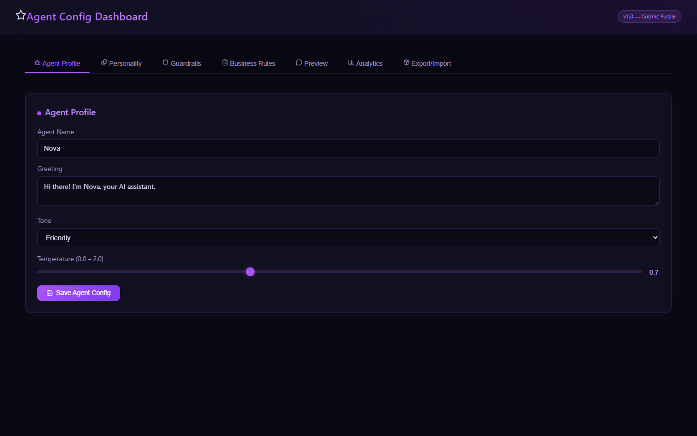
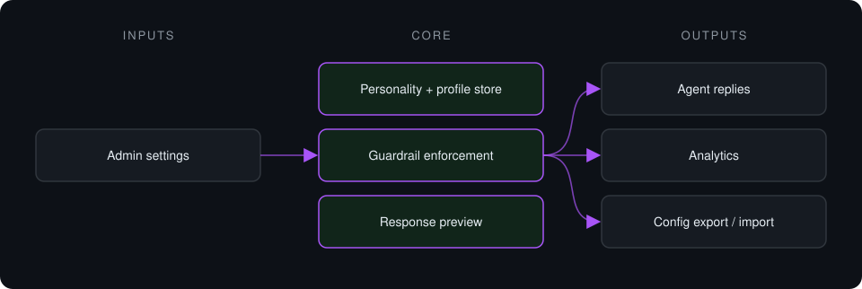
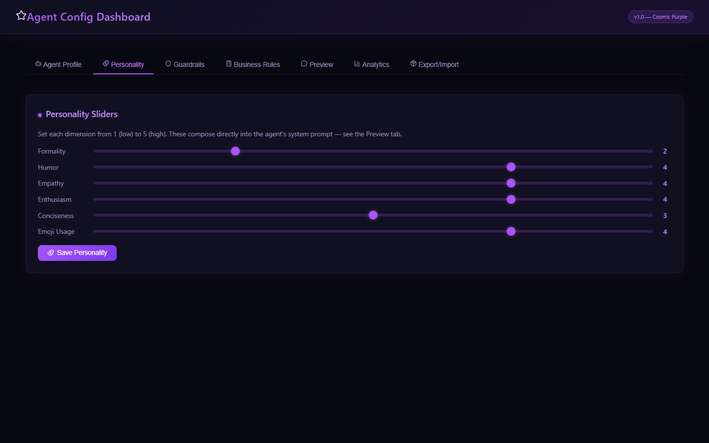

# AI Agent Configuration Dashboard

**Reusable dashboard for configuring an AI agent's profile, personality, guardrails and business rules, with live preview and config export.**

> **This is a proprietary project. Source code is private. This page showcases the system's architecture and results.**

**Case study page:** [https://jryahia.github.io/showcase-ai-agent-dashboard/](https://jryahia.github.io/showcase-ai-agent-dashboard/)

## Problem it solves

Client-facing agents need non-developers to adjust tone, rules and limits safely. This dashboard exposes those controls and shows exactly how the configuration changes the agent's replies.

## Architecture

1. The admin sets the agent's profile and personality sliders.
2. Guardrails and business rules are added.
3. Responses are previewed against test messages.
4. The full configuration is exported or imported as JSON.

## Key features

- Personality sliders
- Keyword and topic guardrails
- Business rules: pricing, hours, FAQ
- Live response preview
- Analytics including handoff rate
- Config export / import

## Tech stack

     

## What it does in practice

- Lets a non-technical owner tune an agent without touching code.

## Screenshots

> Screenshots show the app running on seeded demo data, not client data.

**Agent profile configuration**

**Personality sliders**

---

Built by [Yahya Jarray](https://github.com/jryahia). Interested in a similar system? [Get in touch](mailto:yahiajarray43@gmail.com).

This repository contains no source code. It is a case study for a proprietary project. © Yahya Jarray.
